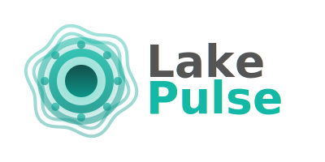

# Lake Pulse 

[![CI][ci-badge]][ci-link]
[![codecov][coverage-badge]][coverage-link]
[![Docs][docs-badge]][docs-link]
[![License: MIT or Apache-2.0][license-badge]][license-link]
[![Rust Version][version-badge]][version-link]
[![Latest Version][crates-badge]][crates-link]

[ci-badge]: https://github.com/adobe/lake-pulse/actions/workflows/ci.yml/badge.svg
[ci-link]: https://github.com/adobe/lake-pulse/actions/workflows/ci.yml
[crates-badge]: https://img.shields.io/crates/v/lake_pulse.svg
[crates-link]: https://crates.io/crates/lake_pulse
[coverage-badge]: https://codecov.io/gh/adobe/lake-pulse/graph/badge.svg?token=3mH5uUJ6se
[coverage-link]: https://codecov.io/gh/adobe/lake-pulse
[license-badge]: https://img.shields.io/badge/license-MIT_or_Apache--2.0-blue
[license-link]: ./LICENSE-APACHE
[version-badge]: https://img.shields.io/badge/rust-1.88+-orange
[version-link]: https://releases.rs/docs/1.88.0/
[docs-badge]: https://img.shields.io/badge/docs-passing-green
[docs-link]: https://docs.rs/lake_pulse/latest/lake_pulse/



A Rust library for analyzing data lake table health across multiple formats (Delta Lake, Apache Iceberg, Apache Hudi, Lance) and storage providers (AWS S3, Azure Data Lake, GCS, Local).

## Supported Formats

[![Delta Lake][delta-badge]][delta-link]
[![Apache Iceberg][iceberg-badge]][iceberg-link]
[![Apache Hudi][hudi-badge]][hudi-link]
[![Lance][lance-badge]][lance-link]

[delta-badge]: docs/badges/delta-lake.svg
[delta-link]: https://github.com/delta-io/delta
[iceberg-badge]: docs/badges/apache-iceberg.svg
[iceberg-link]: https://github.com/apache/iceberg
[hudi-badge]: docs/badges/apache-hudi.svg
[hudi-link]: https://github.com/apache/hudi
[lance-badge]: docs/badges/lance.svg
[lance-link]: https://github.com/lancedb/lance

## Overview

Lake Pulse provides comprehensive health metrics for your data lake tables, including:
- File organization and compaction opportunities
- Metadata analysis and schema evolution
- Partition statistics
- Time travel/snapshot metrics
- Storage efficiency insights

## Quick Start

### Basic Example - Analyzing a Delta Lake table on AWS S3

```rust
use lake_pulse::{Analyzer, StorageConfig};

#[tokio::main]
async fn main() {
    let storage_config = StorageConfig::aws()
        .with_option("bucket", "my-bucket-1234")
        .with_option("region", "us-east-1")
        .with_option("access_key_id", "the_access_key_id")
        .with_option("secret_access_key", "the_secret_access_key")
        .with_option("session_token", "session_token_if_needed");
    
    let analyzer = Analyzer::builder(storage_config).build().await.unwrap();

    // Generate report
    let report = analyzer.analyze("my/table/path").await.unwrap();

    // Print pretty report
    println!("{}", report);
}
```

## Supported Table Formats

- **Delta Lake** - Full support for transaction logs, deletion vectors, and Delta-specific metrics
- **Apache Iceberg** - Metadata analysis, snapshot management, and Iceberg-specific features
- **Apache Hudi** - Basic support for Hudi table structure analysis and metrics
- **Lance** - Modern columnar format with vector search capabilities

## Storage Configuration

Lake Pulse uses the [`object_store`](https://docs.rs/object_store/) crate for cloud storage access. Configuration options are passed through to the underlying storage provider.

### AWS S3 Configuration Options

Common options for S3 (see [object_store AWS documentation](https://docs.rs/object_store/latest/object_store/aws/enum.AmazonS3ConfigKey.html)):
- `bucket` - S3 bucket name
- `region` - AWS region (e.g., "us-east-1")
- `access_key_id` - AWS access key ID
- `secret_access_key` - AWS secret access key
- `session_token` - Optional session token for temporary credentials
- `endpoint` - Optional custom endpoint URL

### Azure Configuration Options

Common options for Azure (see [object_store Azure documentation](https://docs.rs/object_store/latest/object_store/azure/enum.AzureConfigKey.html)):
- `container` - Azure container name
- `account_name` - Storage account name
- `tenant_id` - Azure tenant ID
- `client_id` - Service principal client ID
- `client_secret` - Service principal client secret

### GCP Configuration Options

Common options for GCP (see [object_store GCP documentation](https://docs.rs/object_store/latest/object_store/gcp/enum.GoogleConfigKey.html)):
- `bucket` - GCS bucket name
- `service_account_key` - Path to service account JSON key file

### Local Filesystem

```rust
let storage_config = StorageConfig::local();
let analyzer = Analyzer::builder(storage_config).build().await.unwrap();
let report = analyzer.analyze("/path/to/table").await.unwrap();
```

## Examples

See the [`examples/`](examples/) directory for more detailed usage examples:
- `s3_store.rs` - AWS S3 example
- `adl_store.rs` - Azure Data Lake example
- `local_store.rs` - Local filesystem example
- `local_store_iceberg.rs` - Iceberg table example
- `local_store_hudi.rs` - Hudi table example
- `local_store_lance.rs` - Lance table example

Run examples with:
```bash
cargo run --example s3_store
```

## Documentation

For detailed information on configuration options, refer to the `object_store` crate documentation:
- [AWS S3 Configuration](https://docs.rs/object_store/latest/object_store/aws/enum.AmazonS3ConfigKey.html)
- [Azure Configuration](https://docs.rs/object_store/latest/object_store/azure/enum.AzureConfigKey.html)
- [GCP Configuration](https://docs.rs/object_store/latest/object_store/gcp/enum.GoogleConfigKey.html)

## License

See LICENSE files for details.

