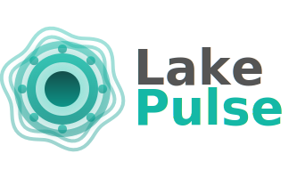

A Rust library for analyzing data lake table health — *checking the pulse* — across multiple formats (Delta Lake, Apache Iceberg, Apache Hudi, Lance) and storage providers (AWS S3, Azure Data Lake, GCS, HDFS, Local).

# Documentation

This directory contains documentation resources for Lake Pulse.

## Supported Formats

[![Delta Lake][delta-badge]][delta-link]
[![Apache Iceberg][iceberg-badge]][iceberg-link]
[![Apache Hudi][hudi-badge]][hudi-link]
[![Lance][lance-badge]][lance-link]

[delta-badge]: https://img.shields.io/badge/Delta_Lake-00acd3?style=for-the-badge&logo=data:image/svg%2bxml;base64,PHN2ZyB4bWxucz0iaHR0cDovL3d3dy53My5vcmcvMjAwMC9zdmciIHZpZXdCb3g9IjAgMCA2MDAgNjAwIiB3aWR0aD0iMTQiIGhlaWdodD0iMTQiPgogIDxwYXRoIGZpbGw9IiNmZmZmZmYiIGQ9Ik0zMTEsMGM2LjA3LDEsOC4xLDMuNjgsMTEuNTYsOC42Miw4OC43MiwxNTIuMjIsMTc4Ljg0LDMwNi40NywyNzAuMzcsNDYyLjc2LDMuNTIsNi40NSw1Ljg4LDEzLjMzLDcuMDcsMjAuNjN2MThjLTIuMTUsMjIuMjUtMjUuODQsMzUuOTgtNDQuMSw0NS4zMi0zMC41NCwxNS42Mi02NC4yNiwyNS43OS05Ny45LDI2LjY4aC0zMmMtMjcuNjEtLjQ4LTU0LjYtOS43MS04MC43NS0yMS44NC0zMC42My0xNS4yMy02MS42NC0yOS41OC05My4wMy00My4wNS04MC41Ni0zMy44LTE3MC45My00LjgyLTI0My40OCwzMy00Ljk1LDEuOTctNy44NywxLjI3LTguNzMtMi4xMXYtNmMzMC42NC00NS4xLDY4LjU2LTg0LjUsMTIwLjc1LTEwMy43NSw1Ny41NS0yMS4yMywxMTYuMy0xNi4zOSwxNzEuNjEsOC44OSwxNC44MSw2Ljc3LDI4LjIsMTYuMDEsNDIuNjIsMjMuMzgsNDAuMywyMC42MSw4NS44OSwzMy4yOCwxMzEuMiwyMy4xNiwxMC45LTIuNDMsMjguMDEtNS40MywyMS4yLTIwLjU3LTU5LjU4LTk2LjczLTExMi4xMS0xOTguNDctMTcyLjIxLTI5NC43OS01LjAzLTguMDYtOS43My0xNS42My0xNy41OC00LjI0LTMyLjY4LDQ3LjQtNTcuNjgsMTA0LjktODkuNzYsMTUzLjIzLTEuNDYsMy4xNi0zLjc5LDUuNzkuNTgsNy43Nyw0LjEyLDEuODcsMTMuNDMsMi44OCwxOC41OSw0LjQxLDMyLjQsOS41OSw2My4xNSwyNS4zOSw4OS40Nyw0Ni41MywzLjc3LDMuMDMsMjEuMDksMTcuNzksMjIuMDgsMjAuOTEsMi4yNyw3LjIxLTIuNDgsMTIuNzQtOS44LDExLjg3LTgwLjM4LTQyLjU1LTE2Ny41Ny0zMS4yNS0yNTAuMjctMi44My05LjIyLDMuMTctMjIuMDMsMTEuOTEtMjIuNDQtNS40QzEzNC4wMSwyNzQuOCwyMTMuODQsMTM5LjkxLDI5Mi45OCw0Ljc2bDcuMDItNC43NmgxMVoiLz4KPC9zdmc+Cg==
[delta-link]: https://github.com/delta-io/delta
[iceberg-badge]: https://img.shields.io/badge/Apache_Iceberg-90d4f0?style=for-the-badge&logo=data:image/svg%2bxml;base64,PHN2ZyB4bWxucz0iaHR0cDovL3d3dy53My5vcmcvMjAwMC9zdmciIHZpZXdCb3g9IjAgMCA1MiA1MiI+CiAgICA8ZGVmcz4KICAgICAgICA8c3R5bGU+CiAgICAgICAgICAgIC5zdDAgeyBmaWxsOiAjMjY2ZmE4OyB9CiAgICAgICAgICAgIC5zdDEgeyBmaWxsOiAjOTBkNGYwOyB9CiAgICAgICAgICAgIC5zdDIgeyBmaWxsOiAjYjhlMWYyOyB9CiAgICAgICAgICAgIC5zdDMgeyBmaWxsOiAjZTlmNmZkOyB9CiAgICAgICAgICAgIC5zdDQgeyBmaWxsOiAjNThhZmRkOyB9CiAgICAgICAgICAgIC5zdDUgeyBmaWxsOiAjYjZlMGYyOyB9CiAgICAgICAgICAgIC5zdDYgeyBmaWxsOiAjNGQ4YWM4OyB9CiAgICAgICAgICAgIC5zdDcgeyBmaWxsOiAjZjRmYWZkOyB9CiAgICAgICAgICAgIC5zdDggeyBmaWxsOiAjMjg3YWJlOyB9CiAgICAgICAgICAgIC5zdDkgeyBmaWxsOiAjNjhjMWVhOyB9CiAgICAgICAgPC9zdHlsZT4KICAgIDwvZGVmcz4KICAgIDxjaXJjbGUgY2xhc3M9InN0OCIgY3g9IjI2IiBjeT0iMjYiIHI9IjI1Ii8+CiAgICA8cGF0aCBjbGFzcz0ic3QyIiBkPSJNIDUgMTIuNSBBIDI1IDI1IDAgMCAxIDQ3IDEyLjUgWiIvPgogICAgPHBvbHlnb24gY2xhc3M9InN0NSIgcG9pbnRzPSI5LDE4IDI1LDEyLjUgMjUsMjUiLz4KICAgIDxwb2x5Z29uIGNsYXNzPSJzdDEiIHBvaW50cz0iOSwxOCAyNSwyNSAxNywzMiIvPgogICAgPHBvbHlnb24gY2xhc3M9InN0MSIgcG9pbnRzPSIxMiwxMi41IDI1LDEyLjUgOSwxOCIvPgogICAgPHBvbHlnb24gY2xhc3M9InN0MCIgcG9pbnRzPSIyNSwyNSAzNSwyMCA0MSwxNyAzNSwyNSIvPgogICAgPHBvbHlnb24gY2xhc3M9InN0NiIgcG9pbnRzPSIzNSwxMi41IDQwLDEyLjUgNDEsMTcgMzUsMjAiLz4KICAgIDxwb2x5Z29uIGNsYXNzPSJzdDkiIHBvaW50cz0iMjUsMTIuNSAzNSwxMi41IDM1LDIwIDI1LDI1Ii8+CiAgICA8cG9seWdvbiBjbGFzcz0ic3Q3IiBwb2ludHM9IjEzLDEwLjUgMzgsMTAuNSAzNCw4LjUgMTcsOC41Ii8+CiAgICA8cG9seWdvbiBjbGFzcz0ic3QzIiBwb2ludHM9IjEzLDEwLjUgMzgsMTAuNSA0MCwxMi41IDEyLDEyLjUiLz4KICAgIDxwb2x5Z29uIGNsYXNzPSJzdDYiIHBvaW50cz0iMjUsMjUgMzUsMjUgMzUsMzMgMzAsMzYiLz4KICAgIDxwb2x5Z29uIGNsYXNzPSJzdDUiIHBvaW50cz0iMTcsMzIgMjUsMzQgMjUsMzkgMTgsMzgiLz4KICAgIDxwb2x5Z29uIGNsYXNzPSJzdDEiIHBvaW50cz0iMjUsNDcgMjUsMzkgMTgsMzgiLz4KICAgIDxwb2x5Z29uIGNsYXNzPSJzdDkiIHBvaW50cz0iMjUsMzQuNCAyNSwzOSAzMCwzNiIvPgogICAgPHBvbHlnb24gY2xhc3M9InN0MCIgcG9pbnRzPSIyNSwzOSAyNSw0NyAzNSwzMyIvPgogICAgPHBvbHlnb24gY2xhc3M9InN0NCIgcG9pbnRzPSIyNSwyNSAyNSwzNC40IDE3LDMyIi8+CiAgICA8cG9seWdvbiBjbGFzcz0ic3Q4IiBwb2ludHM9IjI1LDI1IDMwLDM2IDI1LDM0LjQiLz4KPC9zdmc+Cg==
[iceberg-link]: https://github.com/apache/iceberg
[hudi-badge]: https://img.shields.io/badge/Apache_Hudi-eeeeee?style=for-the-badge&logo=data:image/svg%2bxml;base64,PHN2ZyB4bWxucz0iaHR0cDovL3d3dy53My5vcmcvMjAwMC9zdmciIHZpZXdCb3g9IjAgMCA5MDAgNTc2Ij4KICAgIDxkZWZzPgogICAgICAgIDxzdHlsZT4KICAgICAgICAgICAgLmQgeyBmaWxsOiAjMTgzYjcwOyB9CiAgICAgICAgICAgIC5sIHsgZmlsbDogIzM2YmNmOTsgfQogICAgICAgIDwvc3R5bGU+CiAgICA8L2RlZnM+CiAgICA8ZyB0cmFuc2Zvcm09InNjYWxlKDEuOCkiPgogICAgICAgIDxwYXRoIGNsYXNzPSJsIiB0cmFuc2Zvcm09InRyYW5zbGF0ZSgwLCAxNikgcm90YXRlKDIsIDI1MCwgMTYwKSIgZD0iTTg4LjUsMTEuNSBMMTc3LjUsNDIgMTEzLDEyNy41IDk5LDg1LjUgQzY4LDk5IDUwLDEyMyA0NSwxNTcgNDAsMTg2IDUwLDIxMyA3MCwyMzggTDQ2LjUsMjY1IEM5LDIyNiAtMiwxODAgMTQuNSwxMjYgMjIsMTAyIDM2LDgxIDU2LjUsNjUuNSA2Nyw1NyA3OCw1MCA4OC41LDQ3IEw3OC41LDEzLjUgWiIvPgogICAgICAgIDxwYXRoIGNsYXNzPSJsIiBkPSJNMjA0LDY1IEw2MywyOTggSDMzNyBaIi8+CiAgICAgICAgPHBhdGggY2xhc3M9ImQiIGQ9Ik0yNDQsODUgTDEwMywzMTggSDM3NyBaIi8+CiAgICAgICAgPHBhdGggY2xhc3M9ImQiIHRyYW5zZm9ybT0idHJhbnNsYXRlKDEwLCAxNTEpIHJvdGF0ZSgtNTgsIDI1MCwgMTYwKSIgZD0iTTQxMS41LDMwOC41IEwzMjIuNSwyNzggMzg3LDE5Mi41IDQwMSwyMzQuNSBDNDMyLDIyMSA0NTAsMTk3IDQ1NSwxNjMgNDYwLDEzNCA0NTAsMTA3IDQzMCw4MiBMNDUzLjUsNTUgQzQ5MSw5NCA1MDIsMTQwIDQ4NS41LDE5NCA0NzgsMjE4IDQ2NCwyMzkgNDQzLjUsMjU0LjUgNDMzLDI2MyA0MjIsMjcwIDQxMS41LDI3MyBMNDIxLjUsMzA2LjUgWiIvPgogICAgPC9nPgo8L3N2Zz4K
[hudi-link]: https://github.com/apache/hudi
[lance-badge]: https://img.shields.io/badge/Lance-ff734a?style=for-the-badge&logo=data:image/svg%2bxml;base64,PHN2ZyB4bWxucz0iaHR0cDovL3d3dy53My5vcmcvMjAwMC9zdmciIHZpZXdCb3g9IjAgMCAyMzAgMjMwIiB3aWR0aD0iMTQiIGhlaWdodD0iMTQiPgogIDxwYXRoIGZpbGw9IiNmZmZmZmYiIGQ9Ik01OS4wMSwyNC45OWw4LjQ5LTExLjk5QzgzLjg0LS4wOSwxMDUuNjQsNS44LDExMy41LDI0Ljk5YzIuOTQtMTAuNjcsMTQuMDEtMTguMzgsMjQuOTYtMTkuMDMsMjcuMjEtMS42LDM5LjkxLDMzLjIxLDE4Ljg2LDQ5Ljg2bC05LjMyLDUuMTZjOS4yLDEuNSwxNS43MSw5LjYsMTguNDksMTguMDIsMTIuMDktMzIuNDYsNTkuMTEtMjIuMDUsNTQuNDIsMTMuNDEtMi45MiwyMi4wMy0zMy4wNCwzMC4yMy00Ny45NCwxNC4xMS0zLjE5LTMuNDYtNC4wNC03LjI1LTYuOTYtMTAuNTItMS42NCw3Ljk1LTkuMDMsMTUuMzYtMTcuMDEsMTcuMDEsNy41Myw1LjE4LDEzLjk0LDkuMTcsMTcuMTksMTguMywxMC4wNywyOC4zNy0yNS4wNyw0OS40OC00Ni4yMywyOS4yM2wtNi45NS0xMS41M2MtMi4yLDguNjktOS42LDE1LjQ5LTE4LjAxLDE4LjAxbDcuNDksMy45OWMxNi4xMywxMi4wMSwxNiwzNy45Mi0yLjQ0LDQ3LjU1LTM2LDE4Ljc5LTU5Ljk2LTM3LjI1LTIyLjA1LTUxLjA2LTcuNy0zLjAyLTE1LjQyLTkuMDYtMTcuMDItMTcuNWwtMS45OC43Yy0xMC42OSwyNy43MS01MS42NywyMS44Ni01My44OS04LjMzLS44OC0xMS44Niw3LjA1LTI0LjgxLDE4Ljg5LTI3LjM4LTEuNTgtMi43Mi01LjA1LTMuMDktNy41LTQuOTktMTguMzYtMTQuMjUtMTMuODMtNDEuMTIsNy40OS00OS41QzUuOSw1My45Ny0xLjIzLDMxLjA0LDExLjQ4LDE1Ljk5LDI1LjM1LS40MSw1My4xMSwzLjc2LDU5LDI0Ljk5aC4wMVpNMTMxLDYwLjAxYy04LjI4LTIuMjgtMTUuNjctOS4zOC0xNy4wMS0xOC4wMWwtNC41Nyw3LjkxYy0xMi4wNSwxNS4xNi0zMy4xMSwxNi40MS00NS40MS41OC0xLjktMi40NC0yLjI3LTUuOTEtNC45OS03LjUtLjQ0LDMuNTEtMy4wNSw3LjUxLTUuNDcsMTAuMDQtMy4zNSwzLjQ5LTguMDUsNC45NS0xMS41NCw3Ljk1LDI1LjE3LDguMjMsMjUuMzUsNDQuNDMsMCw1Mi41MSw3LjY5LDQuMjQsMTQuODEsOS40LDE3LjAxLDE4LjVsNi4wMS05LjQ3YzExLjEyLTEyLjA5LDMxLjQ3LTEzLjQ2LDQyLjM5LS40NCwyLjU1LDMuMDUsMy43OCw3LjI0LDYuNTgsOS45MSwxLjE0LTguNTUsOS40Mi0xNC42MywxNy4wMS0xNy40OS0xNy4zNC03LjYzLTI1LjYtMjkuMTUtMTMtNDUsMy40NS00LjM0LDguODUtNi4xNCwxMy05LjQ5aDBaIi8+CiAgPGNpcmNsZSBmaWxsPSIjZmZmZmZmIiBjeD0iMTkzLjM3IiBjeT0iMTk0LjE4IiByPSIyNy45MSIvPgo8L3N2Zz4K
[lance-link]: https://github.com/lancedb/lance

<!-- 
The format badges are created using shields.io based on base64 encoded version of the SVG logo.

To get source SVGs, get the last part of the URL after the `base64,`. Get that encoded string
and decode it using a base64 decoder, and you'll get the SVG representation of the logo.
-->

## Examples

See the [examples](../examples/) directory for more detailed usage examples.

## Cloud Storage Documentation

For detailed information on configuration options, refer to the `object_store` and 
`hdfs-native-object-store` crates documentation:
- [AWS S3 Configuration](https://docs.rs/object_store/latest/object_store/aws/enum.AmazonS3ConfigKey.html)
- [Azure Configuration](https://docs.rs/object_store/latest/object_store/azure/enum.AzureConfigKey.html)
- [GCP Configuration](https://docs.rs/object_store/latest/object_store/gcp/enum.GoogleConfigKey.html)
- [HDFS Configuration](https://docs.rs/hdfs-native-object-store/latest/hdfs_native_object_store/)

## Supported Storages

See [LAKE_PULSE_SUPPORTED_STORAGES.md](LAKE_PULSE_SUPPORTED_STORAGES.md) for a 
comparison of storage providers supported by Lake Pulse.

## License

See LICENSE files for details.